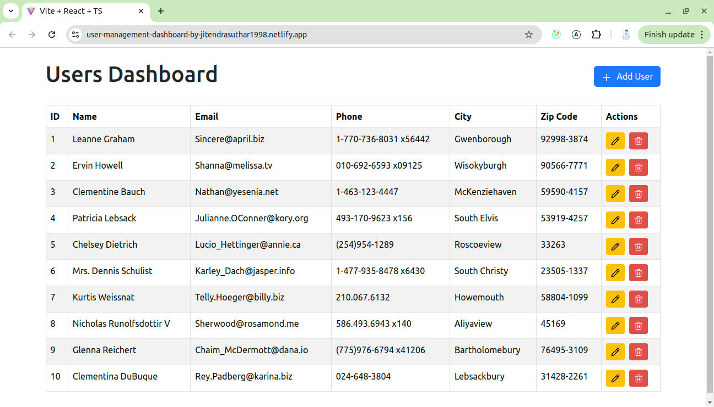

# User Management Dashboard

This is a **User Management Dashboard** built with **React.js** and **Redux Toolkit**, integrated with the **JSONPlaceholder API**. It allows the management of user records by displaying them in a table with options to **add**, **edit**, and **delete** users.

The app is deployed on **Netlify** and is designed to provide a smooth user experience for managing user data.

## Features

- **List Users**: Fetch and display user records in a table format with columns for `id`, `name`, `email`, `phone`, and `city with zip code`.
- **Add User**: Add a new user to the list.
- **Edit User**: Modify the details of an existing user.
- **Delete User**: Remove a user from the list.
- **Responsive Layout**: The dashboard is designed to be responsive and user-friendly.
- **Toast Notifications**: Show success or error notifications for actions like add, edit, and delete.

## Screenshot



## Demo

You can see the live demo of the app on [Netlify](https://user-management-dashboard-by-jitendrasuthar1998.netlify.app/).

## Tech Stack

- **React.js**: For building the user interface.
- **Redux Toolkit**: For state management.
- **Axios**: For making API requests.
- **React-Bootstrap**: For building the table layout and modals.
- **React-Toastify**: For displaying toast notifications.
- **CSS/SCSS**: For styling the app.

## Getting Started

To run this project locally, follow these steps:

### Prerequisites

Ensure that you have the following installed:

- **Node.js**: You can download it from [here](https://nodejs.org/).
- **npm** or **yarn**: Comes with Node.js.

### Installation

1. Clone the repository:

   ```bash
   git clone https://github.com/your-username/user-management-dashboard.git
   ```

2. Navigate to the project directory:

   ```bash
   cd user-management-dashboard
   ```

3. Install dependencies:

   ```bash
   npm install
   # or
   yarn install
   ```

4. Start the development server:

   ```bash
   npm start
   # or
   yarn start
   ```

5. Open [http://localhost:3000](http://localhost:3000) in your browser to view the app.

## Features and Functionality

### 1. List Users

The dashboard displays a list of users fetched from the **JSONPlaceholder API** in a table format. The table includes the following columns:

- **ID**
- **Name**
- **Email**
- **Phone**
- **City with Zip Code**

### 2. Add User

You can add new users to the list by filling out a form with details like name, email, and address (including city and zip code).

### 3. Edit User

The app allows you to edit the details of existing users. The updated user details will reflect in the table.

### 4. Delete User

You can delete any user from the list. A modal will prompt for confirmation before deleting the user.

### 5. Toast Notifications

The app shows toast notifications upon successfully adding, editing, or deleting a user, using **React-Toastify** for real-time feedback.

## Folder Structure

```
/src
  /assets           # Static assets (images, icons, etc.)
  /components       # React components (DeleteModal.tsx, UserModal.tsx)
  /store            # Redux-related files (store.ts, usersSlice.ts)
  /types            # TypeScript type definitions (users.ts)
  App.tsx           # Root component
  index.tsx         # Entry point for React
```

### Notable Files:

- **`store.ts`**: Contains Redux store configuration.
- **`usersSlice.ts`**: Contains Redux slice for managing users.
- **`UserModal.tsx`**: Modal component for adding or editing users.
- **`DeleteModal.tsx`**: Modal component for confirming user deletion.
- **`users.ts`**: TypeScript types for the user data.

## Deployment

This app is deployed on **Netlify**. You can view the live demo from the following link:

[Live Demo on Netlify](https://user-management-dashboard-by-jitendrasuthar1998.netlify.app/)

## License

This project is licensed under the MIT License.
